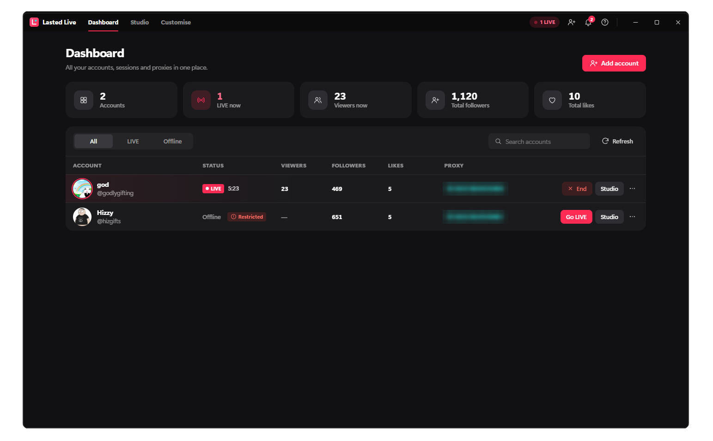
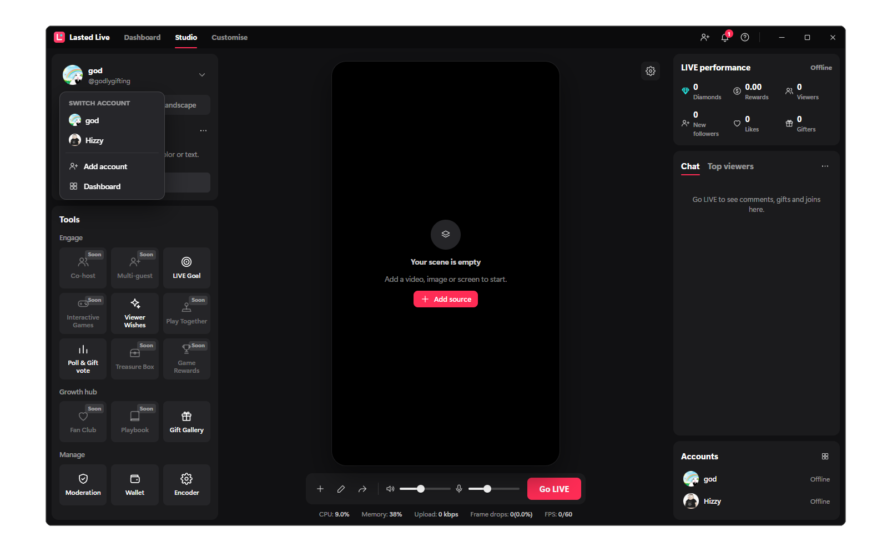

# Lasted Live Free

A desktop studio for going LIVE on TikTok from your PC. Put together a scene
from videos, images, text and screen or window captures, then stream it to
your TikTok account in a couple of clicks. It works a lot like TikTok LIVE
Studio, in one small app.

## Download

Grab **LastedLiveFree.exe** from the
[latest release](https://github.com/dna0102/LastedLiveFree/releases/latest)
and run it. There's no installer.

Windows may show "Windows protected your PC" the first time, because the exe
isn't code-signed. Click **More info**, then **Run anyway**.

**You need:** Windows 10 or 11 (64-bit) and a TikTok account that's allowed to
go LIVE.

## First run

1. **ffmpeg.** The app uses ffmpeg to encode the stream. If you don't already
   have it, the app downloads it for you (about 110 MB, one time only) and
   checks the download before using it.
2. **Your hardware.** The app detects your CPU and graphics card and picks the
   best encoder for them: NVENC on NVIDIA, AMF on AMD, Quick Sync on Intel. If
   none of those work, it falls back to x264 on the CPU. You can see what it
   found under **Customise → System**.
3. **Log in.** Scan the QR code with the TikTok app on your phone
   (Search → scan icon), or paste your session cookies.

## Going LIVE

1. Open **Studio** and add sources: a video, an image, a color, text, or a
   screen or window capture.
2. Drag and resize them on the canvas. Select a source to crop, flip or center it.
3. Press **Go LIVE**, pick a title and topic, and you're streaming.

While you're LIVE you can change the title, run polls, set a LIVE goal, show
Viewer Wishes, and watch comments, gifts and your top viewers come in.

## Free vs paid

This is the free edition. It runs one account on your own internet
connection, and videos loop until you end the LIVE.

Paid-only tools show up greyed out in Studio with a **Paid** tag.

## Lasted Live (official version)

The official version has everything:

- several accounts LIVE at once, each through its own proxy
- moderation (muted words, moderators, kicked users)
- LIVE standing alerts for new restrictions
- ending the LIVE automatically when a video finishes

**To buy it, get in touch at [lasted.dev](https://lasted.dev).**





## Build it yourself

You'll need [Go](https://go.dev/dl/) 1.26 or newer and the
[Wails](https://wails.io) CLI:

```bash
go install github.com/wailsapp/wails/v2/cmd/wails@latest
```

Then, from the repo folder:

```bash
wails build -trimpath
```

The exe ends up in `build/bin/`. Use `wails dev` to run it with live logs
while you work on it.

## Good to know

- Your login, scenes and settings are saved in `%APPDATA%\LastedLiveFree`.
  The login is stored as plain session cookies, so don't share that folder.
- ffmpeg is found next to the exe, on your `PATH`, or in common install
  locations. Set `FFMPEG_PATH` to point at a specific one.
- A few TikTok actions (host chat, pinning a goal) need a signature only
  TikTok's own app can produce, so they aren't available here.
- This project isn't affiliated with or endorsed by TikTok.
